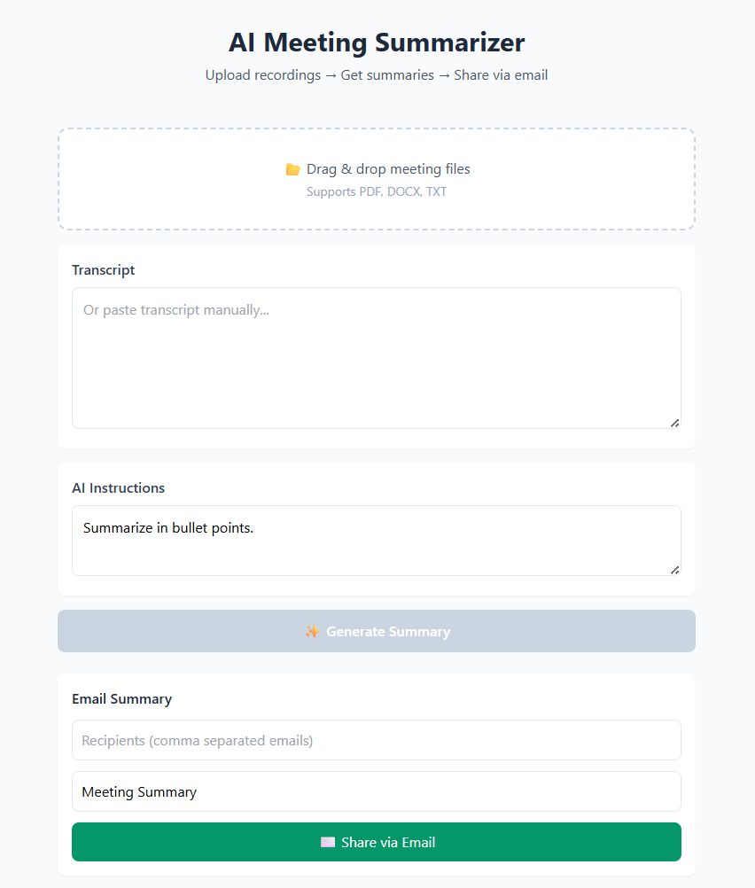
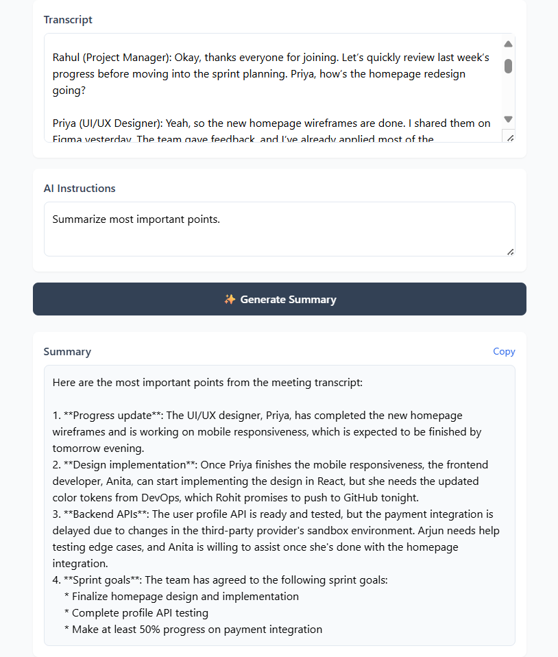
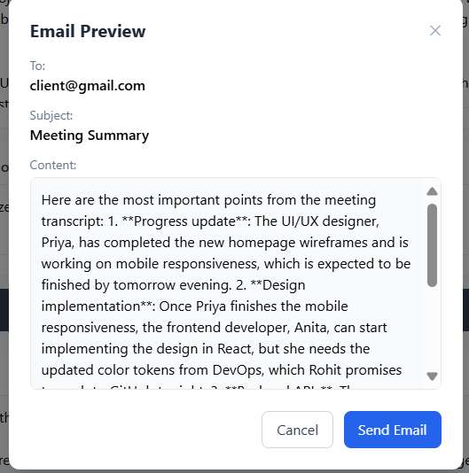

# 🤖 MeetMind - AI Meeting Notes & Summaries

**Transform your meeting transcripts into actionable insights with AI-powered summarization and automated email delivery.**

## 📋 Overview

MeetMind is an intelligent meeting assistant that processes meeting transcripts from various formats (PDF, DOCX, TXT) and generates comprehensive summaries using AI. The application features an intuitive drag-and-drop interface, customizable AI prompts, and seamless email integration for sharing meeting insights.[1][2]

## ✨ Key Features

### 📁 **Multi-Format Support**
- **Drag & Drop Upload**: PDF, DOCX, and TXT files
- **Manual Input**: Paste transcripts directly into the interface
- **Batch Processing**: Handle multiple meeting files efficiently

### 🎯 **AI-Powered Intelligence**
- **Custom Prompts**: Tailor AI summaries to your specific needs
- **Smart Summarization**: Extract key points, action items, and decisions
- **Editable Outputs**: Review and modify summaries before sending

### 📧 **Seamless Communication**
- **Email Preview**: Review formatted emails in modal before sending
- **SMTP Integration**: Direct email delivery to stakeholders
- **Professional Formatting**: Clean, structured email templates

### 🛠️ **User Experience**
- **Interactive Interface**: Modern, responsive design
- **Real-time Processing**: Instant feedback and progress indicators
- **Cross-Platform**: Works on desktop and mobile devices

## 🖼️ Screenshots & Examples

### Main Dashboard
<details>
<summary>📸 Click to view screenshots</summary>



</details>

### File Upload Process
<details>
<summary>📸 Click to view screenshots</summary>


</details>

### AI Summary Generation
<details>
<summary>📸 Click to view screenshots</summary>



</details>

### Email Preview Modal
<details>
<summary>📸 Click to view screenshots</summary>



</details>

### Example Meeting Summary Output
```

***

📅 Meeting Date:August 18, 2025  
👥 Attendees:Sarah Chen, Marcus Thompson, Elena Rodriguez, David Kim, Jessica Williams  

📝 Key Discussion Points:

-  Analysis of Q2 performance metrics and competitive landscape assessment
-  User experience challenges in the current onboarding workflow
-  Technical roadmap prioritization for document processing and AI integration features
-  Resource planning for the upcoming innovation sprint and team collaboration
-  Budget reallocation discussion for enhanced marketing initiatives and tool improvements

✅ Action Items:

-  Complete comprehensive market analysis report for European markets - Assigned to: Marcus Thompson - Due: August 23, 2025
-  Conduct user interview sessions with recent customers and compile insights - Assigned to: Elena Rodriguez - Due: August 21, 2025
-  Design technical specification document for enhanced document processing - Assigned to: Sarah Chen - Due: August 26, 2025
-  Organize innovation sprint kickoff meeting and resource planning - Assigned to: Jessica Williams - Due: August 22, 2025
-  Review and approve updated marketing campaign proposals - Assigned to: David Kim - Due: August 24, 2025

🎯 Decisions Made:

-  Approved 15% increase in marketing budget allocation for Q3 expansion efforts
-  Selected document processing and AI summarization as top priority features for next development cycle
-  Established bi-weekly user feedback review sessions starting September 2025

📋 Next Steps:

-  Schedule comprehensive team briefing for innovation sprint methodology and expectations
-  Distribute completed market research and user feedback analysis reports
-  Initiate prototype development for prioritized platform enhancements
-  Establish regular client consultation sessions for ongoing product validation

***

### Extended Example Transcript (~750 words):

***

Meeting Facilitator (Sarah): Good afternoon, team. Thank you all for making time today. We have quite a bit to cover, so let's dive right in. Marcus, could you start us off with the Q2 performance overview?

Marcus: Absolutely, Sarah. Looking at our Q2 numbers, we're seeing some interesting trends. Overall revenue is up 12% compared to Q1, with particularly strong growth in European markets - we're talking about a 15% increase there. However, our North American segment has plateaued, which is concerning given our investment there.

Elena: That aligns with the feedback I've been collecting from our customer success team. European clients seem more engaged with our platform, especially the AI summarization features. But I'm hearing different stories from our US customers.

David: What kind of feedback are you getting specifically?

Elena: Well, the most common complaint is about the onboarding process. Users are finding it overwhelming, particularly when they're trying to upload multiple document formats. We've had several cases where customers abandoned the process halfway through.

Jessica: That's troubling. Are we talking about technical issues or user interface problems?

Elena: It's a combination of both. The drag-and-drop functionality works well, but users get confused when files don't process immediately. They're not sure if something went wrong or if they need to wait longer.

Sarah: This ties into our roadmap discussion. We've been debating whether to focus on new integrations or improve existing features. Based on what Elena is sharing, it sounds like we should prioritize user experience improvements.

Marcus: I agree. In my conversations with prospects, the most frequently requested features are better document processing and more intuitive AI prompt customization. Integration requests come up, but they're secondary.

David: From a marketing perspective, we can definitely leverage improved user experience as a selling point. But we need to be strategic about timing. If we're going to launch a campaign around these improvements, I'll need additional budget.

Sarah: What are you thinking in terms of numbers, David?

David: To do this properly - including updated content, targeted advertising, and customer communication - I'd need about a 15% increase from our current Q3 allocation.

Jessica: Before we commit to that, let's make sure we can deliver on the technical side. Sarah, what's your assessment of the development timeline for these improvements?

Sarah: If we prioritize document processing and AI summarization enhancements, we're looking at roughly 8-10 weeks for a solid implementation. That would put us at late October for a beta release.

Elena: That timeline works well for gathering additional user feedback. I can schedule interviews with our recent customers to validate our improvement priorities.

Marcus: Speaking of validation, I think we should also conduct more thorough competitive analysis. I've noticed some new players entering the market with similar features.

Sarah: Good point. Can you expand your Q2 analysis to include competitive positioning?

Marcus: Definitely. I'll focus on European markets since that's where we're seeing the most growth.

Jessica: This brings me to our innovation sprint planning. Given these priorities, I think we should structure the sprint around user experience optimization rather than feature expansion.

David: That makes sense. It also gives us a clearer narrative for marketing - we're not just adding features, we're making the platform more intuitive and powerful.

Elena: I like that approach. And if we establish regular feedback sessions, we can stay ahead of user needs instead of always playing catch-up.

Sarah: Let's formalize that. Elena, can you set up bi-weekly user feedback reviews starting next month?

Elena: Absolutely. I'll create a structured process for collecting and analyzing feedback.

Jessica: For the innovation sprint, I'll need to coordinate with the development team and set clear expectations. When should we kick this off?

Sarah: Let's target next week for the kickoff. That gives everyone time to prepare their respective components.

David: And the marketing budget increase?

Sarah: I think we have consensus on the 15% increase. The timing aligns well with our product improvements, and the European growth justifies the investment.

Marcus: Agreed. The market data supports increased investment in marketing and user experience.

Elena: This all sounds great. I'm excited to dig deeper into user feedback and see how these improvements impact customer satisfaction.

Sarah: Excellent. Let's summarize our action items and next steps before we wrap up. Everyone clear on their responsibilities and timelines?

[All members confirm understanding]

Sarah: Perfect. Thanks everyone for a productive discussion. Let's reconvene next week to check progress on these initiatives.

```

## 🏗️ Technology Stack

### Backend
- **Node.js**: Server runtime environment
- **Express.js**: Web application framework
- **AI Integration**: [Specify your AI service/model]
- **File Processing**: Multi-format document parsing
- **SMTP**: Email delivery system

### Frontend
- **React/Next.js**: Modern web interface
- **Drag & Drop API**: File upload functionality
- **Modal Components**: Interactive preview system
- **Responsive Design**: Cross-device compatibility

## 🚀 Getting Started

### Prerequisites
- Node.js (v14 or higher)
- npm or yarn
- SMTP server credentials (Gmail, Outlook, etc.)

### Installation & Setup

1. **Clone the Repository**
   ```bash
   git clone https://github.com/anshmittal2004/MeetMind-AI-Meeting-Notes-Summaries.git
   cd MeetMind-AI-Meeting-Notes-Summaries
   ```

2. **Backend Setup**
   ```bash
   cd server
   npm install
   cp .env.example .env
   # Configure your environment variables
   npm run dev
   ```

3. **Frontend Setup**
   ```bash
   cd client
   npm install
   cp .env.example .env
   # Configure your environment variables
   npm run dev
   ```

4. **Environment Configuration**
   ```env
   # Backend (.env)
   AI_API_KEY=your_ai_service_key
   SMTP_HOST=your_smtp_host
   SMTP_PORT=587
   SMTP_USER=your_email
   SMTP_PASS=your_password
   
   # Frontend (.env)
   REACT_APP_API_URL=http://localhost:5000
   ```

## 💡 How to Use

### Step 1: Upload Meeting Transcript
- **Drag & Drop**: Simply drag your PDF, DOCX, or TXT file into the upload area
- **Browse Files**: Click to select files from your computer
- **Paste Text**: Manually input transcript text for immediate processing

### Step 2: Customize AI Prompt
- **Default Templates**: Choose from pre-configured summary styles
- **Custom Instructions**: Write specific prompts for tailored outputs
- **Format Preferences**: Specify desired summary structure and length

### Step 3: Generate & Edit Summary
- **AI Processing**: Watch real-time generation of your meeting summary
- **Edit Mode**: Modify generated content to match your requirements
- **Preview**: Review the final summary before proceeding

### Step 4: Email Distribution
- **Recipient Selection**: Add multiple email addresses
- **Email Preview**: Review formatted email in modal popup
- **Send**: Deliver professional meeting summaries instantly

## 🎯 Use Cases

### **Corporate Meetings**
- Board meetings and executive briefings
- Team standups and project reviews
- Client calls and stakeholder updates

### **Educational Settings**
- Lecture summaries and academic discussions
- Student organization meetings
- Research collaboration sessions

### **Professional Services**
- Legal depositions and client consultations
- Medical conferences and case reviews
- Consulting sessions and strategy meetings

## 🔧 Configuration Options

### AI Model Settings
```json
{
  "model": "gpt-4",
  "temperature": 0.7,
  "max_tokens": 1500,
  "custom_prompts": {
    "executive_summary": "Focus on high-level decisions and strategic outcomes",
    "action_items": "Emphasize tasks, deadlines, and responsibilities",
    "detailed_notes": "Comprehensive coverage of all discussion points"
  }
}
```

### Email Templates
- **Professional**: Formal business communication style
- **Casual**: Relaxed tone for internal team updates
- **Executive**: Concise summaries for leadership
- **Custom**: User-defined templates

## 🚀 Future Enhancements

### Planned Features
- **Real-time Transcription**: Live meeting processing
- **Calendar Integration**: Automatic scheduling and reminders
- **Multi-language Support**: Global accessibility
- **Advanced Analytics**: Meeting insights and trends
- **API Endpoints**: Third-party integrations

### Community Contributions
- **Bug Reports**: Help improve stability and performance
- **Feature Requests**: Suggest new functionality
- **Documentation**: Enhance user guides and tutorials
- **Code Contributions**: Submit pull requests for improvements

## 📄 License

This project is licensed under the MIT License - see the [LICENSE](LICENSE) file for details.

## 🤝 Contributing

We welcome contributions from the community! Please read our [Contributing Guidelines](CONTRIBUTING.md) before submitting pull requests.

## 📞 Support

- **Issues**: Report bugs and request features on [GitHub Issues](https://github.com/anshmittal2004/MeetMind-AI-Meeting-Notes-Summaries/issues)
- **Discussions**: Join community conversations in [GitHub Discussions](https://github.com/anshmittal2004/MeetMind-AI-Meeting-Notes-Summaries/discussions)

***

**Made with ❤️ Ansh Mittal
